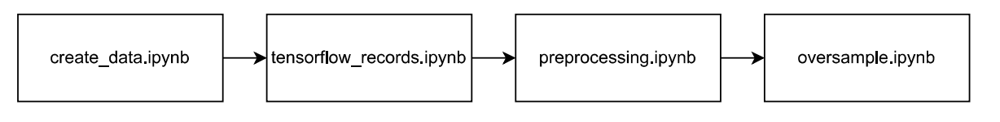
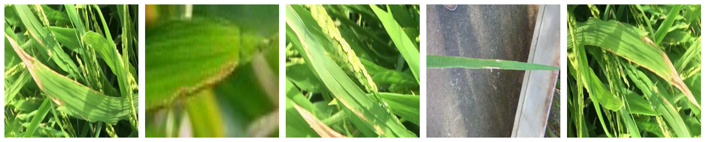
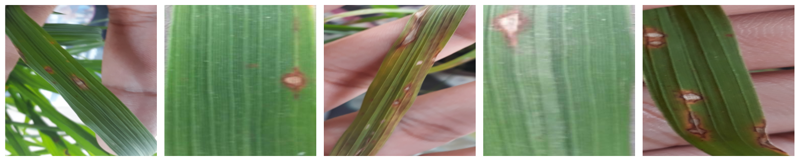
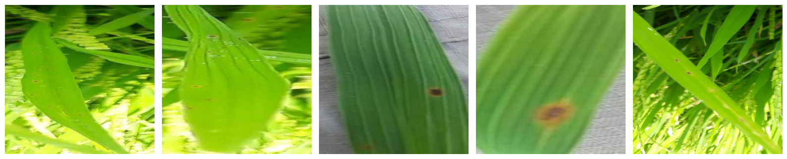
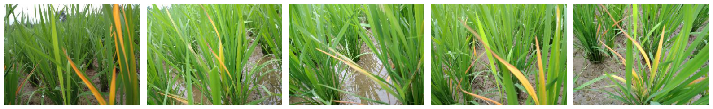

# Rice Leaf Disease Identification 🌾🚀

For over 50% of the world's population, rice serves as a primary source of daily sustenance. However, a significant challenge arises in rice cultivation: Rice Leaf Diseases. These diseases account for the destruction of 10% to 15% of the global rice harvest annually. Therefore, the identification of these diseases is crucial to initiate proactive measures against them. Unfortunately, many farmers lack the expertise to accurately identify these diseases on their own, necessitating external support.

This is where machine learning proves invaluable. In this project, three distinct machine learning approaches were developed to address the challenge of identifying rice leaf diseases. These methods encompass a spectrum of complexity, beginning with a decision tree algorithm, progressing to more intricate ensemble methods like the random forest, and culminating in a cutting-edge convolutional neural network (CNN) leveraging Transfer Learning with ResNet50, developed by Microsoft Research.

## Installation

### 1. **Clone GIT Reponsitory**

   git clone https://github.com/JanMuehlnikel/Rice-Leaf-Disease-Identification/edit/master/README.md
   
### 2. **Install dependencies**

   pip install -r requirements.txt
   
### 3. **Downlaod Data (Rice Leaf Diseas Samples)**

   https://data.mendeley.com/datasets/fwcj7stb8r/1 
   
   REF: (sethy, prabira Kumar (2020), “Rice Leaf Disease Image Samples”, Mendeley Data, V1, doi: 10.17632/fwcj7stb8r.1)
   
### 4. **Copy data into the project**

   Extract the data to the /data/ folder

## Usage

### Data Analysis
For analyzing the image data used in this project, refer to the `analysis.ipynb` notebook located in the `/Exploration/` directory.

### Data Preprocessing Pipeline
To prepare the data for machine learning training, follow the preprocessing pipeline. Run the notebooks in the `/Pipeline/` directory in the following order:

### Model Training
To train the models, navigate to the `/Model/` directory and select the notebook corresponding to your desired model.

## Results
### This Project considered four different rice leaf diseases:
#### Bacterial Blight

#### Blast

#### Brownspot

#### Tungro

### Performance Metrics for Three Machine Learning Models:

| Metric / Model   | Decision Tree | Random Forest | CNN (ResNet50) |
|------------------|---------------|---------------|----------------|
| Training Time    | 10m 20s       | 1m 20s        | 14m 33s        |
| Accuracy         | 71.95%        | 85.39%        | 95.55%         |
| Precision        | 75.00%        | 86.15%        | 95.86%         |
| Recall           | 72.00%        | 85.40%        | 95.55%         |
| F1-Score         | 72.00%        | 85.55%        | 95.61%         |

## Note of thanks

  
   
  
  

